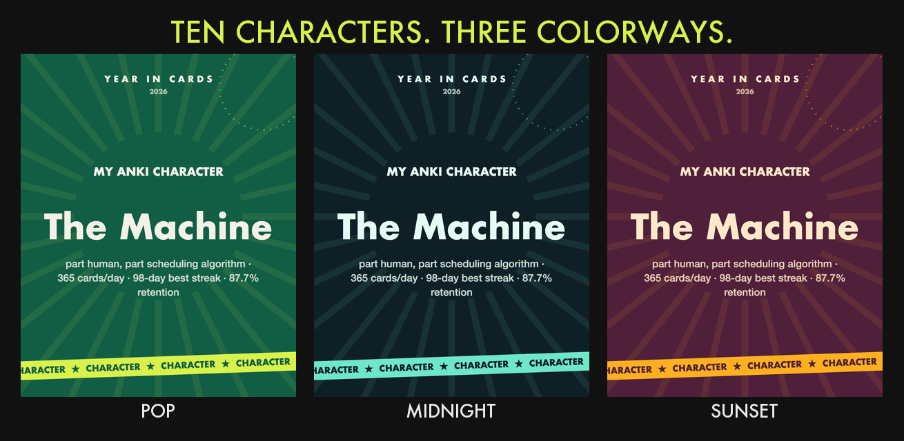
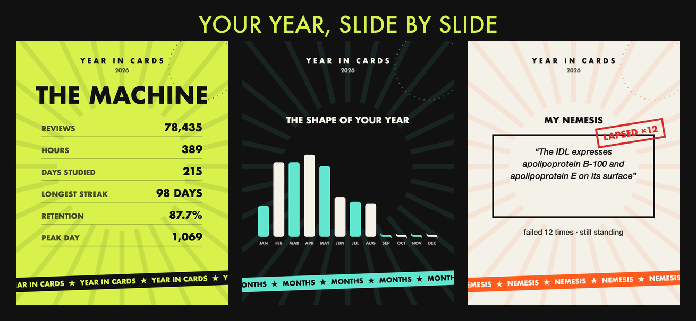
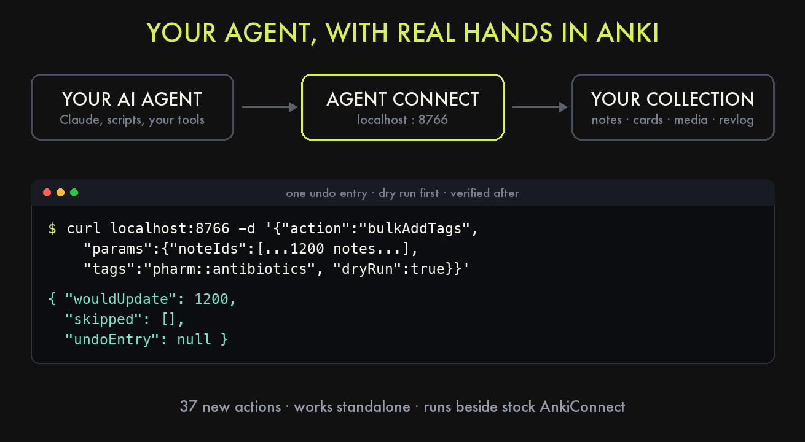
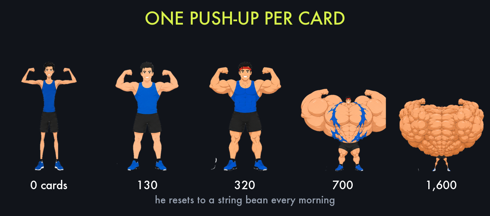

# Anki add-ons

Add-ons I've built for [Anki](https://apps.ankiweb.net/), all published on AnkiWeb.

| Add-on | What it does | AnkiWeb |
|---|---|---|
| **Year in Cards** | Your year of reviews as a Spotify-Wrapped-style story, ending with your Anki character | [1715143676](https://ankiweb.net/shared/info/1715143676) |
| **Manna** | Quiet Scripture encouragement at the moments that matter while you review | [1138259160](https://ankiweb.net/shared/info/1138259160) |
| **Agent Connect** | AnkiConnect fork with 37 new actions for AI agents and bulk automation | [333760925](https://ankiweb.net/shared/info/333760925) · [source](https://github.com/mattccorrell-svg/agent-connect) |
| **Swole Mate** | A gym bro in the corner who does a push-up for every card you answer | AnkiWeb |

This repo hosts listing screenshots.

---

### Year in Cards

### Agent Connect

### Manna

### Swole Mate

